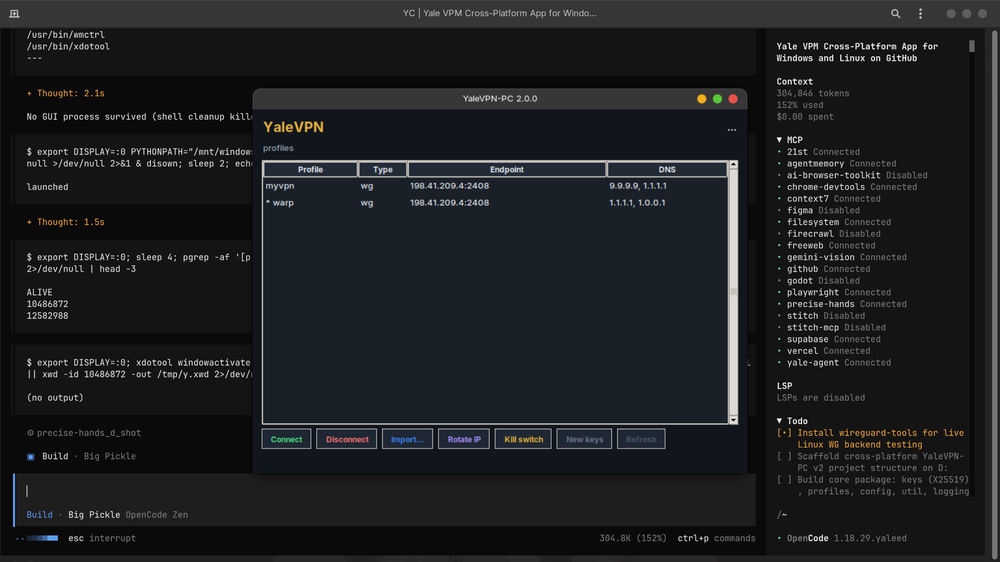

# YaleVPN-PC

**Desktop WireGuard + Cloudflare WARP VPN client for Linux and Windows.**
One Python codebase, on-device keys, no account, no cloud control plane.
Your phone runs [YaleVPN](https://github.com/yaleedhaque/yalevpn) for Android;
this is the desktop companion — with **automatic public-IP rotation** on top.

- Tunnel **WireGuard** profiles (kernel mode on Linux, the official WireGuard
  client on Windows) and the **WARP** daemon.
- **Rotate** your WARP egress IP on demand — fresh Cloudflare egress for
  per-IP rate limits/buckets (verified before/after, IPv4+IPv6).
- **Kill switch**, **DNS pinning**, **leak test**, **stats**, **encrypted
  vault**, **auto-start** (systemd / Task Scheduler) and a small **GUI** —
  plus a full CLI for automation.

```
                                        ┌──────────────┐
   you ── WireGuard/WARP tunnel ──────▶ │  cloud edge  │  fresh egress IP
                                        └──────────────┘
        yalevpn rotate  ──► re-register  │  on demand
```

## Screenshots

**Desktop control panel (`yalevpn gui`):** profile table (name / type /
endpoint / DNS), Connect / Disconnect / Import / **Rotate IP** / kill-switch
toggle / on-device keygen, live egress readout.



## Install

### Linux

```bash
curl -sO https://raw.githubusercontent.com/yaleedhaque/YaleVPN-PC/master/install.sh
bash install.sh
```

Requires at least one backend. Recommended:

```bash
sudo apt install wireguard-tools cloudflare-warp nftables iptables
pip3 install --user cryptography
```

### Windows

```powershell
powershell -ExecutionPolicy Bypass -File install.ps1
```

Or grab **`YaleVPN-win64.exe`** from the latest
[Release](https://github.com/yaleedhaque/YaleVPN-PC/releases). Either way,
install the [official WireGuard client for Windows](https://www.wireguard.com/install/)
first (it provides the tunnel backend).

## Quick start

```bash
yalevpn doctor                    # what's available on this machine
yalevpn add ~/myserver.conf --default   # import a WireGuard profile
yalevpn up                        # connect (default)
yalevpn status                    # tunnel + egress
yalevpn rotate                    # fresh WARP egress IP
yalevpn killswitch on             # fail-closed leak protection
yalevpn gui                       # desktop control panel
```

## Features at a glance

| Area | Linux | Windows |
|---|---|---|
| WireGuard tunnels | kernel `wg-quick` (+`wireguard-go` fallback) | official `wireguard.exe` tunnel services |
| Cloudflare WARP | `warp-cli` | `warp-cli` (recent builds) or WARP-as-WireGuard profile |
| Egress IP rotation | ✔ verified | ✔ |
| Kill switch | nftables/iptables chain | Adv-Firewall allow-endpoint emulation (honest best-effort) |
| DNS leak protection | systemd-resolved / resolv.conf | `netsh` |
| On-device X25519 keys | ✔ | ✔ (bundled cryptography) |
| Encrypted vault | AES-256-GCM (optional) | same |
| Auto-start / rotation timer | systemd user units | Task Scheduler |
| Stats · leaktest · doctor · GUI | ✔ | ✔ |

Full matrix: [`docs/features.md`](docs/features.md) ·
Linux guide: [`docs/linux.md`](docs/linux.md) ·
Windows guide: [`docs/windows.md`](docs/windows.md)

## CLI

```
yalevpn up [profile]      connect (default profile, a name, or 'warp')
yalevpn down / status / ip
yalevpn add <file|url|->  import a WireGuard config  (--name, --default)
yalevpn list / show / edit / remove / export / default / newkey
yalevpn warp status|up|down · rotate · warp export · warp bootstrap
yalevpn killswitch on|off|status
yalevpn dns set|restore|status
yalevpn leaktest · stats · autostart · doctor · gui · help
```

## How IP rotation works

`yalevpn rotate` deletes and re-registers the Cloudflare WARP consumer
registration, then reconnects:
a fresh device registration is given a different endpoint from the shared
consumer pool — typically a new IPv6 (v4 is often pinned by Cloudflare). The
result is verified by comparing egress before/after (v4 **or** v6 must move)
and `ROTATED`/`WEAK` is reported honestly.

## Windows export

`yalevpn warp export` writes a plain **WARP WireGuard profile** —
`[Interface]` + `[Peer]` — that imports into the Windows/Android/macOS
WireGuard apps directly, identical to the one the Android app imports.

## Security posture

- Keys are generated on-device (`yalevpn newkey`) and never leave the machine.
- Profiles stored mode-0600; vault layer uses AES-256-GCM with scrypt
  key-derivation when configured.
- Daemon/CLI make no network calls beyond the tunnel endpoint and egress
  probes (`api64.ipify.org` / `1.1.1.1/cdn-cgi/trace`).
- The kill switch is a dedicated chain/rule set, removed cleanly on `off`.

## Development

```bash
python3 -m pytest tests/ -q        # requires pytest (or: python3 tests/test_core.py)
python3 -m yalevpn ...             # run from src
bash install.sh                    # stage a ~/.local install
```

```text
src/yalevpn/
  cli.py           argparse CLI (full parity with the GUI)
  gui.py           tkinter control panel
  autostart.py     systemd units + Task Scheduler
  stats.py         transfer / handshake / session + leak test
  core/            util · keys (X25519) · profiles (wg-quick) · vault
  backends/        wireguard (wg-quick / wireguard.exe) · warp · killswitch · dns
```

## License

MIT — see [LICENSE](LICENSE).
Third-party notes: [THIRD_PARTY.md](THIRD_PARTY.md).